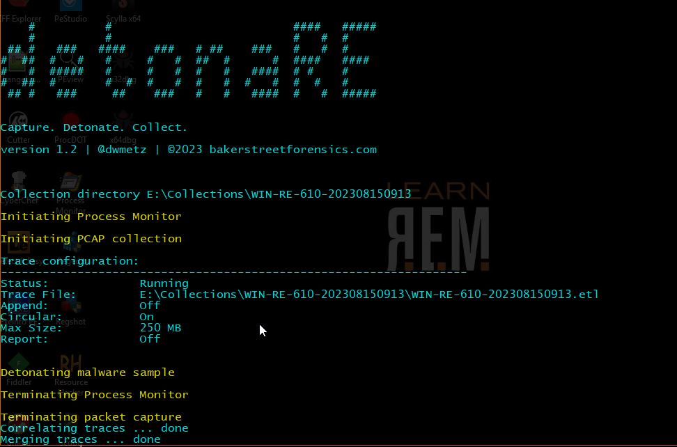

<div align="center">
 
 <p>
  <h2>
   detonaRE
  </h2>
  <h5>
      Capture. Detonate. Collect.
   </h5>
<p>
<p>
 </div>
<div align="center">
  
  <div align="left">
  <h5>

  From Latin - "to detonate"

   Functions:
  </h5>

- initiates .etl packet capture
- initiates Process Monitor with a filter applied for the malware to be detonated
- launches malware sample
- terminates packet capture after specified interval
- initiates evidence collection with Magnet RESPONSE (memory, process, and triage capture)
- terminates the malware process
- converts collected .etl file to .pcap with etl2pcapng.
- converts collected .pml to .csv

<h5>
   Prerequisites:
</h5>

>- [Magnet RESPONSE](https://support.magnetforensics.com/s/article/Collect-evidence-for-incident-response-investigations-with-Magnet-RESPONSE)
>- [etl2pcapng.exe](https://github.com/microsoft/etl2pcapng)
>
```
## variable configuration:
$malwspath = "E:" ## malware source path
$malwdpath = "C:\Users\REM\Desktop\Malware\" ## malware destination path
$malware = "redline-76ca4a.exe" ## malware executable
$pcaptime = 180 ## duration in seconds for pcap capture
$toolsdir = "E:\Tools" ## MagnetRESPONSE.exe and etl2pcapng.exe
```

For a walkthrough of the code visit [BakerStreetForensics](https://bakerstreetforensics.com/?p=1295).

Video demonatration on [YouTube](https://youtu.be/XsnuJ_yJm3I)

